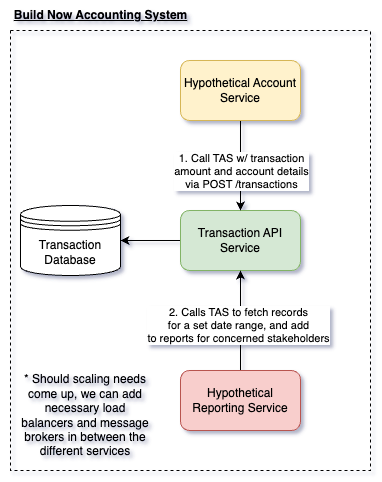

[](https://github.com/psf/black)
[](https://github.com/astral-sh/ruff)
[](https://www.python.org/downloads/release/python-3115/)




# Yet-Another-Transaction-API
A simple API service that records transaction data.

## Requirements and Functionality

### What is a `Transaction`?
* In the context of this API, we're defining a transaction as: a single monetary
record that an account (from an external service) will log.
* Transactions are stored as SAR (Saudi Riyal) values. They're converted to USD
(US Dollars) at run time, on demand.


### The API service allows you to:
* Create `Transaction` records
* Retrieve `Transaction` records
* Generate a report/summary from `Transactions` within a date range.
* Head to the  `/schema/swagger-ui/` route to view all API functionality.


### What is a report?
* A report contains a count of all `Transaction`s in the system
* A report contains the total transaction amount in SAR and USD.
* If the time-period for a report is not specified, it'll be determined based on
`Transaction`s in the past 30 days.


## Getting Started
* Note: `SERVER_NAME=LOCAL` ensures that you have access to some nice tooling
for the project, such as, seeding scripts, `mypy`, `isort,` `black`, etc.

* The project assumes your machine has the following software and their specific
versions:
    * A *nix operating system
    * Docker OR Python 3.11.5^

### Setting Up Locally
* Clone the the repository from GitHub
* `cd` into the correct directory `yet-another-transaction-api`
* Create your own `.env` file using all the variables in `.env.example.`
The following values need to be replaced with your environment specific ones:
    * `DB_NAME`: Replace with your local Postgres settings. Examples are given.
    * `SERVER_NAME`: Since we're developing locally, this should be `LOCAL`.
    * `API_KEY`: Generating any API key for this will work. I just use
    `from django.utils.crypto import get_random_string` to generate it.
* If Python:
```bash
# Create a virtual environment and install requirements (I'd suggest pyenv)
pip install -r requirements/local.txt
pre-commit install
```
* If Docker:
	* Build: `docker build -t yata .`
	* Run: `docker run -p 8000 yata`
* NOTE: If you're on Windows, setting up WSL and following the above
instructions should work out nicely.


## Assumptions, Considerations and Limitations
* To keep things simple and easy, we're using SQLite with the project. However,
it'll be easy to migrate to another database such as Postgres fairly easily.

* There's very little "security" so to speak. For instance, we're using a single
API key in the environment. The API key is hashed, but that's a band-aid.
Finally, if we're in the context of micro-services, we can fairly **assume**
that client secrets will be fairly secure.

* The scope of the assignment suggests a fixed exchange rate - a better way
would probably be keeping records of exchange rates over a period of time, and
convert to those rates on a need-basis. This also falls in line with database
normalization rules. Anyway, a fixed rate of 1 SAR = 0.27 USD is being used.

* Again, since we're in the context of a micro service, I've assumed that users
are being handled and tracked elsewhere. That said, we're still storing a
`created_by` `uuid` in the Transaction model.

* Debits are represented as - amounts and credits are represented as + amounts
However, again, we're going to restrict to "positive" transactions only for now.
Transactions depend on the type of the account they're from (i.e. asset,
liability, etc.). Again, it's assumed `Account`s are handled by a different
microservice where the transactions will be converted correctly to debit and
credit amounts.

* I've tried to keep things super simple and easy so that it's easy to get
started and test without any complicated settings.

* The report generation functionality is only an endpoint for now, but it'll be
super simple to turn it into a nice PDF or CSV export as well.


## Other notes
* Project structure derived from:
[Django Project Structure](https://github.com/saqibur/django-project-structure)


### API Error Format
* Field/Validation Errors
```json
{
	"success": false,
	"code": 400,
	"type": "field_error",
	"error_message": "Invalid input.",
	"details": [
		{
			"field": "password",
			"errors": [
				"This password is too short. It must contain at least 6 characters."
			]
		}
	]
}
```

* Non-Field Errors
```json
{
	"success": false,
	"code": 401,
	"type": "non_field_error",
	"error_message": "Incorrect authentication credentials.",
	"details": {
		"exception": "AuthenticationFailed",
		"message": "No active account found with the given credentials",
		"code": "no_active_account",
    }
}
```

* Unhandled Exception Errors (This replaces the default Django HTML error page)
```json
{
	"success": false,
	"code": 500,
	"type": "non_field_error",
	"error_message": "Unhandled exception",
	"details": {
		"exception": "AssertionError",
		"message": "The field 'transaction_uuid' was declared on serializer TransactionSerializer, but has not been included in the 'fields' option.",
		"code": "unhandled_exception"
	}
}
```
